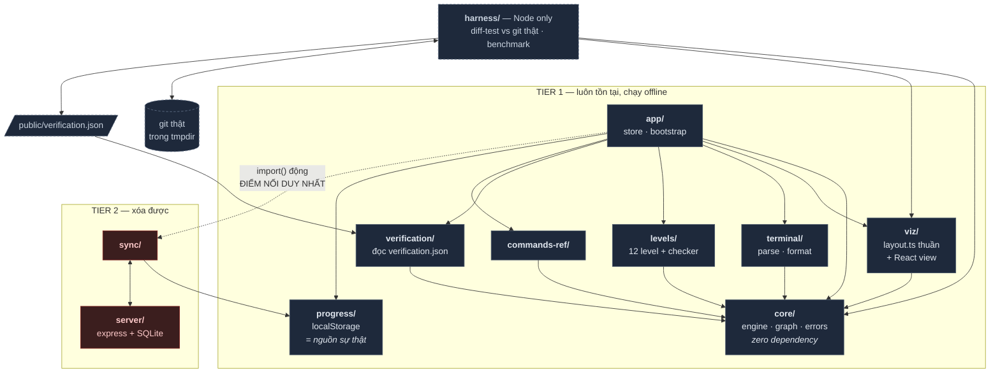

# GitScope

Công cụ học Git bằng trực quan hóa: gõ lệnh Git thật, xem DAG commit thay đổi theo thời gian thực.

Điểm khác biệt của dự án không nằm ở giao diện mà ở **differential testing** — engine được so sánh tự động với `git` thật trên hàng nghìn chuỗi lệnh sinh tự động, và kết quả được publish ngay trong app ở tab Verification.

> **Trạng thái: M1 (scaffold).** Ba contract đã đóng băng, engine còn là stub — mỗi lệnh trả state không đổi. Xem [Trạng thái hiện tại](#trạng-thái-hiện-tại).

---

## Cách chạy

Yêu cầu **Node 20+** (CI chạy Node 24).

```bash
npm ci
```

```bash
npm run dev
```

Mở http://localhost:5173 — hiện shell với 4 tab rỗng.

`better-sqlite3` và `argon2` là native module, `esbuild` cần postinstall. Cả ba đã được duyệt sẵn qua trường `allowScripts` trong `package.json`, nên `npm ci` chạy thẳng, không cần thao tác tay. Nếu npm vẫn hỏi, chạy:

```bash
npm install-scripts approve esbuild better-sqlite3 argon2
```

## Cách test

```bash
npm test
```

| Lệnh | Việc | Chạy khi nào |
|---|---|---|
| `npm run dev` | Vite dev server | — |
| `npm run build` | `tsc --noEmit` rồi `vite build` | — |
| `npm run typecheck` | Chỉ typecheck | mỗi PR |
| `npm test` | Unit test (vitest) | mỗi PR |
| `npm run lint:imports` | Ràng buộc phụ thuộc của `core/` và `progress/` | mỗi PR |
| `npm run check:tier1` | Xóa Tier 2 trên bản sao rồi build | mỗi push vào `main` |
| `npm run diff:quick` | Differential test — vét cạn depth 3 + 5000 case random | mỗi PR |
| `npm run diff:deep` | Vét cạn depth 4, 8 worker | nightly |
| `npm run bench` | Đo `src/viz/layout.ts` trên DAG n = 10²…10⁵ | nightly |
| `npm run report` | Gộp diff + bench → `public/verification.json` | nightly |
| `npm run server` | Tier 2: static + API trong một process | — |

Unit test đặt **cạnh source**: `commit.ts` ↔ `commit.test.ts`. Không có thư mục `tests/` dùng chung — thư mục dùng chung là thư mục ai cũng sửa, tức là thư mục hay conflict.

⚠️ `npm run check:tier1` **xóa thật** `src/sync/` và `server/` trong thư mục hiện tại. Nó dành cho bản checkout sạch của CI; muốn chạy local thì chạy trên một bản sao.

---

## Kiến trúc



Ba điều cần nhớ khi đọc sơ đồ:

- **`core/` không có mũi tên đi ra.** Không React, không DOM, không gì cả. Đây là điều kiện để harness Node import trực tiếp engine — vi phạm nó là làm sập differential testing, tức là làm sập điểm khác biệt duy nhất của dự án.
- **Các module UI không trỏ vào nhau.** Chúng gặp nhau ở `app/store.ts`, nên D2, D3, D4, D6 không bao giờ phải đợi nhau.
- **`sync → progress`, không bao giờ ngược lại.** `progress/` cấm import `sync/` và cấm gọi `fetch`. Đảo chiều là cách phổ biến nhất làm hỏng offline-first, và nó sẽ không lộ ra cho tới lúc demo mất mạng.

Hai ràng buộc trên được **CI kiểm tự động** bằng `npm run lint:imports`, không phải bằng lời hứa trong tài liệu.

Ngoại lệ duy nhất trên sơ đồ: `commands-ref/` được import `viz/` để vẽ sơ đồ mini before→after, vì sơ đồ phải dùng `layout.ts` thật chứ không phải một bản vẽ tay song song.

---

## Hai tier

**Tier 1** là toàn bộ sản phẩm: engine, visualizer, terminal, levels, verification, command reference. Chạy hoàn toàn offline, tiến độ lưu ở `localStorage`.

**Tier 2** là tài khoản + đồng bộ tiến độ qua server. Nó là tùy chọn và **phải xóa được**. `src/sync/` và `server/` có đúng **một** điểm import trong toàn codebase, nằm giữa hai marker trong `src/app/bootstrap.ts`:

```ts
// TIER2-START
const { attachSync } = await import("../sync/attach");
attachSync(progressStore);
// TIER2-END
```

`scripts/strip-tier2.sh` xóa hai thư mục, cắt đoạn giữa hai marker, rồi build. CI chạy nó mỗi lần push vào `main` — fail nghĩa là Tier 2 đã rò rỉ vào Tier 1.

Chọn cách này thay vì feature flag runtime vì ba lý do: nó chứng minh bằng build chứ không bằng lời; nó bắt rò rỉ ngay ngày xảy ra thay vì lúc demo; và `import()` động giữ `sync/` ra khỏi bundle chính, nên Tier 1 không trả chi phí kích thước cho Tier 2.

---

## Cấu trúc

```
src/core/          engine thuần, zero dependency — không React, không DOM
src/viz/           visualizer; layout.ts thuần để harness import được
src/terminal/      parse + format + UI terminal
src/levels/        schema, checker đẳng cấu DAG, 12 level + sandbox
src/progress/      localStorage là nguồn sự thật (Tier 1, luôn tồn tại)
src/verification/  tab đọc public/verification.json
src/commands-ref/  tra cứu 5 lệnh, có sơ đồ mini before→after
src/sync/          Tier 2 — xóa được
src/app/           shell: routing, store, bootstrap
server/            Tier 2 — một process, SQLite, không vào bundle
harness/           Node only: differential test + benchmark
```

Mỗi thư mục có **đúng một chủ**. Nếu hai người cùng sửa một file mỗi ngày, file đó đang đặt sai chỗ.

---

## Ba contract — đóng băng ngày 1

| File | Nội dung | Ai dùng |
|---|---|---|
| `src/core/types.ts` | `RepoState`, `Command`, `Result`, `ErrorClass` | tất cả |
| `src/verification/report.ts` | schema `verification.json` | D5 ghi, D6 đọc |
| `src/progress/types.ts` | `LevelRecord`, `ProgressSet` | D4 và D5 |

Đổi sau ngày 1 cần cả nhóm đồng ý.

**Engine không bao giờ throw.** Lỗi trả về qua `ok: false` + `output` + `errorClass`. Harness so thông báo lỗi như *dữ liệu* chứ không phải như exception. `errorClass` tách riêng khỏi `output` vì hard gate so lớp lỗi, còn soft check mới so chuỗi — nhờ vậy sửa câu chữ không làm đỏ CI, nhưng sai lớp lỗi thì có.

**Bốn seam staging luôn có mặt, luôn `null`:** `snapshot`, `workingTree`, `index`, và ranh giới hàm `DetectConflicts`. v1 không có `git add`; thêm nó sau này không được phép đụng vào Contract 1.

**`ProgressSet` dùng chung một kiểu cho ba nơi** — localStorage, payload API, hàng SQLite. Nhờ vậy `merge()` test được bằng unit test thuần, không cần mạng và không cần database.

---

## Trạng thái hiện tại

Xong (M1):

- Scaffold Vite + TS + Tailwind 4 + Vitest; `npm run dev` lên được
- Toàn bộ dependency, kể cả Tier 2 — không ai phải sửa `package.json` sau ngày 1
- Ba contract
- Engine stub: 5 lệnh, đúng kiểu, không throw
- App shell 4 tab · `MiniGraph` stub · `verification.json` giả
- CI: typecheck + test + lint:imports + tier1-build

Chưa có: engine thật, layout DAG, parser terminal, nội dung 12 level, harness diff-test, Tier 2 server. Mọi file trong các thư mục đó hiện là stub rỗng.

---

## Những gì cố tình không có

| Không dùng | Lý do |
|---|---|
| Monorepo / workspaces | Một repo là đủ; thêm tầng là thêm chỗ hỏng |
| Redux / Zustand | `useReducer` bọc engine là đủ; engine đã là single source of truth |
| ORM | 2 bảng cố định; `schema.sql` + truy vấn thuần ngắn hơn cấu hình ORM |
| Passport.js | Chỉ dùng local strategy thì viết tay ngắn hơn phần cấu hình |
| ESLint | Dự án chỉ cần một luật riêng — `scripts/check-imports.ts` 40 dòng, không cần 4 dependency |
| Thư mục `components/` · `utils/` dùng chung | Mời gọi trừu tượng hóa sớm; `utils/` thành bãi rác trong mọi dự án |
| Barrel file `index.ts` | Che mất đồ thị phụ thuộc, dễ tạo vòng |
| Thư viện chart · `xterm.js` · D3 | Nhu cầu nhỏ hơn chi phí; SVG viết tay ~40 dòng là đủ |
| Docker Compose đa service | Tier 2 chỉ có một process; không có service thứ hai để compose |

Bảng này không phải để trang trí — câu "tại sao không dùng X" gần như chắc chắn xuất hiện trong Q&A.
