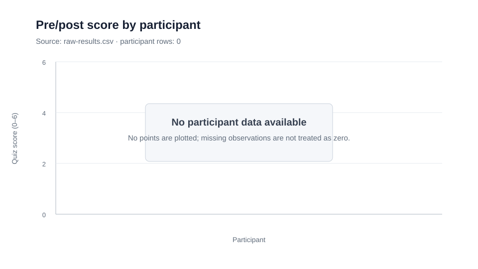
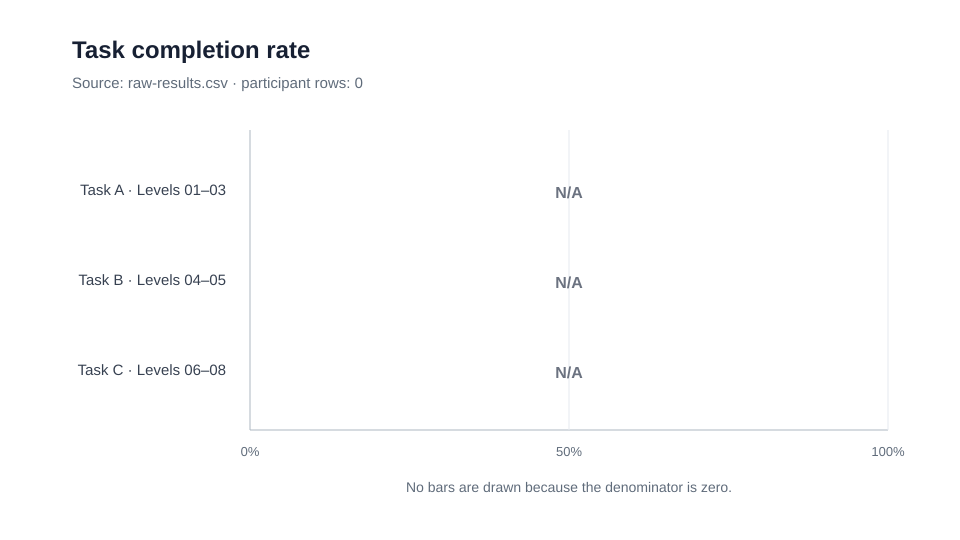

# GitScope user-evaluation results

## Trạng thái dữ liệu

### Observation

- `raw-results.csv` có 1 dòng: dòng header.
- Số dòng participant: **0**.
- Không có `participant_code`, điểm quiz, completion, thời gian, lệnh sai, stuck note hoặc checkpoint nào để tổng hợp.

### Interpretation

- Các chỉ số dưới đây **không tính được**. `N/A` không có nghĩa là 0.
- Không có bằng chứng trong file để kết luận về khả năng học, usability, detached HEAD hoặc merge của GitScope.
- Không suy diễn rằng participant đã được tuyển nhưng bị thiếu khỏi file.

## Bảng dữ liệu sạch

[clean-results.csv](clean-results.csv) là bảng participant-level phục vụ các phép tính được yêu cầu. File chỉ có header vì nguồn không có dòng participant; không có hàng mẫu hoặc giá trị điền thay.

| Participant | Pre | Post | Thay đổi | Task A | Task B | Task C | Detached HEAD (L04) | Merge commit (L07) | Merge commit (L08) |
|---|---:|---:|---:|---|---|---|---|---|---|
| _Không có dòng dữ liệu_ | N/A | N/A | N/A | N/A | N/A | N/A | N/A | N/A | N/A |

## Kết quả định lượng

### Điểm pre/post theo participant

Không có participant để lập cặp pre/post.

| Chỉ số | Kết quả |
|---|---:|
| Số cặp pre/post đầy đủ | 0 |
| Thay đổi trung bình (`post - pre`) | N/A |
| Thay đổi median (`post - pre`) | N/A |
| Median và khoảng pre-score | N/A |
| Median và khoảng post-score | N/A |

### Completion rate theo task

Task được ánh xạ theo cấu trúc trong file và tên task của bộ evaluation: Task A gồm level 01–03, Task B gồm level 04–05, Task C gồm level 06–08. Vì không có bản ghi, không có mẫu số để tính rate. Không báo cáo `0%` vì điều đó sẽ ngụ ý đã có người thử nhưng không hoàn thành.

| Task | Level | Số participant có dữ liệu | Hoàn thành độc lập | Hoàn thành có gợi ý | Hoàn thành bất kỳ | Completion rate |
|---|---|---:|---:|---:|---:|---:|
| A | 01–03 | 0 | N/A | N/A | N/A | N/A |
| B | 04–05 | 0 | N/A | N/A | N/A | N/A |
| C | 06–08 | 0 | N/A | N/A | N/A | N/A |

### Thời gian hoàn thành

| Level | Số quan sát thời gian | Median | Min–max | Số quan sát bị chặn bởi timebox |
|---|---:|---:|---:|---:|
| 01 | 0 | N/A | N/A | N/A |
| 02 | 0 | N/A | N/A | N/A |
| 03 | 0 | N/A | N/A | N/A |
| 04 | 0 | N/A | N/A | N/A |
| 05 | 0 | N/A | N/A | N/A |
| 06 | 0 | N/A | N/A | N/A |
| 07 | 0 | N/A | N/A | N/A |
| 08 | 0 | N/A | N/A | N/A |

### Lệnh sai phổ biến

Không có giá trị trong các cột `levelNN_wrong_commands`. Vì vậy không thể lập danh sách hoặc xếp hạng lệnh sai. Đây không phải bằng chứng rằng không có lệnh sai.

### Điểm bị kẹt theo theme

Không có `levelNN_stuck_notes`, `levelNN_comments` hoặc `levelNN_stuck_count` để mã hóa theme. Không có theme nào được gán; đây không phải bằng chứng rằng người dùng không bị kẹt.

| Theme | Số participant | Bằng chứng quan sát |
|---|---:|---|
| Chưa mã hóa được | N/A | Không có dòng participant trong nguồn |

### Detached HEAD và merge

| Chỉ số | Kết quả |
|---|---:|
| Người hoàn thành detached HEAD, level 04 | N/A |
| Người hoàn thành Task B, level 04–05 | N/A |
| Người hoàn thành merge commit, level 07 | N/A |
| Người hoàn thành merge commit, level 08 | N/A |
| Người hoàn thành toàn bộ merge Task C, level 06–08 | N/A |

Các giá trị trên không được ghi là `0 người`: nguồn không có participant để làm mẫu số.

## Findings

Severity dưới đây phản ánh tác động lên khả năng hoàn tất user evaluation, không phải mức độ nghiêm trọng của lỗi sản phẩm.

| ID | Observation | Interpretation | Severity | Bằng chứng | Đề xuất sửa |
|---|---|---|---|---|---|
| EVAL-01 | File chỉ có header và 0 dòng participant. | Evaluation chưa có dữ liệu để tạo kết quả hoặc finding usability. | Blocker | `raw-results.csv`: 1 dòng, 0 bản ghi | Thu thập và nhập các phiên hợp lệ theo protocol; giữ nguyên quy tắc không thêm hàng cho người không đồng thuận và không điền dữ liệu suy đoán. Chạy lại phân tích sau khi dữ liệu được đối chiếu. |
| EVAL-02 | Schema ban đầu không có trường mô tả nguồn tuyển mẫu hoặc tiêu chí chọn mẫu; file vẫn chưa có bản ghi participant. | Thiếu contract thu thập khiến selection bias không thể được mô tả từ hồ sơ sau này; không được dùng `git_experience_band` để suy ra cách tuyển. | Medium | Reproduction trước sửa: header có `git_experience_band` nhưng thiếu `recruitment_source` và `eligibility_criteria`; số bản ghi là 0 | **Fixed (2026-10-01):** thêm hai trường vào CSV, protocol, data dictionary và observation template. Selection bias vẫn là limitation và không được dùng để điều chỉnh hay suy diễn dữ liệu participant. |

Không gán finding về UI, terminal, graph, detached HEAD hay merge vì file không chứa bằng chứng để hỗ trợ chúng.

### EVAL-02 fix log

- **Root cause:** yêu cầu tuyển 6–8 sinh viên chỉ tồn tại trong hướng dẫn protocol; metadata contract và phiếu quan sát không bắt buộc lưu kênh tuyển hoặc tiêu chí đủ điều kiện.
- **Thay đổi nhỏ nhất:** thêm `recruitment_source` và `eligibility_criteria` vào nguồn dữ liệu thô cùng các điểm nhập liệu/tài liệu tương ứng. Không thêm hoặc suy đoán participant row.
- **Regression test:** `evaluationSchema.test.ts` kiểm tra cả hai cột tồn tại trong CSV schema và observation template.
- **Giới hạn còn lại:** `n = 0`, nên chưa có nguồn tuyển thực tế để mô tả hay định lượng selection bias. Hai trường mới chỉ bảo đảm dữ liệu này sẽ được thu ở các phiên hợp lệ sau.

## Limitations

- **Cỡ mẫu hiện tại:** `n = 0`, nên chưa có kết quả mô tả. Nếu sau này có 6–8 participant như kế hoạch, đó vẫn là mẫu nhỏ; chỉ nên báo cáo quan sát mô tả và không suy rộng ra quần thể hoặc dùng ngôn ngữ “có ý nghĩa thống kê”.
- **Selection bias:** file không có participant row, nên chưa có giá trị `recruitment_source` hoặc `eligibility_criteria` thực tế. Schema nay đã buộc ghi hai trường cho phiên sau, nhưng selection bias vẫn không thể được định lượng hay loại trừ; với mẫu thuận tiện 6–8 người, limitation này phải được nêu khi diễn giải kết quả.
- **Dữ liệu thiếu:** không thể phân biệt “chưa thu thập”, “đã thu thập nhưng chưa nhập” hay “phiên không hợp lệ” chỉ từ file. Báo cáo không chọn một giả thuyết thay cho dữ liệu.
- **Độ tương đương pre/post:** không có câu trả lời để kiểm tra practice effect, áp lực thời gian hoặc độ tương đương của hai form.
- **Build và protocol deviation:** không có hàng dữ liệu để kiểm tra một build cố định, thời lượng phiên hoặc protocol deviation.

## Quy tắc tính khi có dữ liệu hợp lệ

Phần này mô tả phép tính, không phải kết quả quan sát.

- Ghép pre/post bằng `participant_code`; chỉ tính thay đổi khi cả `pre_score` và `post_score` có giá trị hợp lệ.
- Thay đổi từng người là `post_score - pre_score`; mean và median chỉ dùng các cặp đầy đủ.
- Một task hoàn thành bất kỳ khi tất cả level trong task là `independent` hoặc `with_hint`. Báo cáo `independent` riêng; không gộp với `with_hint` trong chỉ số chính.
- Completion rate dùng số người đã thử đủ các level của task làm mẫu số. `MISSING` không được đổi thành thất bại hoặc 0.
- Thời gian level báo cáo median và min–max; các quan sát dừng do timebox được giữ và đánh dấu riêng.
- Lệnh sai được đếm từ chuỗi đã submit; theme bị kẹt được đếm theo số participant gặp theme, không chỉ số episode.
